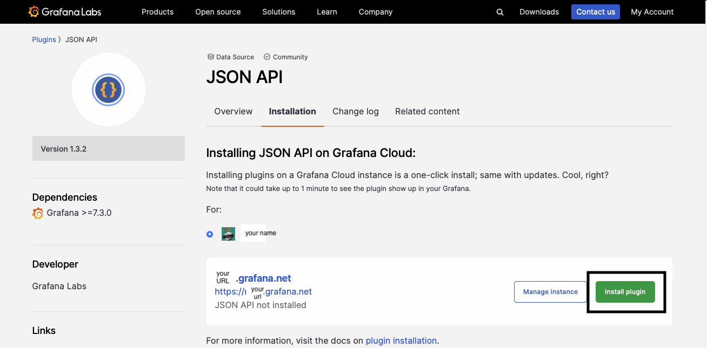

## JSON API quickstart

-------------- START INTRO -------
-------------- END INTRO ---------

From the Grafana Cloud Portal, under "Manage your Grafana Cloud Stack." click "Launch" on the Grafana card.    
(grafana image)  
From the home screen, select "+ Connect Data" and it will take you to the Integrations and Connections  
  

Under "Search itegrations" type in "JSON API"  
  
Select JSON API and it will navigate you to the plugin home page. Select "Installation"  
  
On the installation screen, you will see your user on the account and you will be able to install the plugin (might need to word this better)  
#### V add screenshot from non personal account V
  
Once installed, you will see "manage instance" and "remove plugin"  
  
Navigate back to the Integrations and Connections screen and type in JSON API and you will now see it is installed. Click on the plugin to enter the plugins main page.  
  
On the data source's home page ( might need to re word this because i refered to the home page as the page the download link takes you to), click "Create a JSON API data source" to enter the configuration screen. 
  
In the configuration screen, you are able to name your data source and configure any auth or http to your liking. Once you select a URL you would like to use, click save and test, you will get a green sucess banner at the bottom of your screen, if you get an error, there is a possibility there are authentication issues or an incorrect URL.  
  
Select the dashboards icon on the side navigation and click "New Dashboard" 
  
Select add new Panel.  
  
On the panel page, you will see the data source drop down, select the JSON API data source with its corresponding name you gave it in the configuration.  
  
Select Crypto Exchange and you will see "No data" on the panel, in your upper right corner, you will see the vizualizations dropdown. It is currently set to "Time Series", click on it and on the search input select "table"  
  
  
On the panel options screen, you can name your vizualization anything you want  
  
Now we can start to query our data source.  
Below you can see that we are getting the first markets base asset, quote asset, exchange ID, and the price in USD  
  
We can now duplicate the query, I will duplicate it twice  
  
For the new queries, Lets change the market numbers, once the market numbers are changed and we have multiple queries, you can see a drop down being added in our table with A, B , C  
  

We can rename our queries by hovering over the letter and clicking to edit  
  
  
Now we have a table data source to query and visualize. On the top right, click apply to save our panel.  
  
Back on the dashboard screen you can see the table you just created. If you hover and click on the panel name "table" and scroll down to "more" and click duplicate, it can duplicate our table. Click the newly duplicated table name "edit" 
  
  
  

On the top right in the visualization drop down, click it and select bar gauge. Once you see the visualization, click apply on top to save.  
  
Our dashboard is looking awesome with two visuzliations. Lets add 1 more visualization that displays time series data. Copy one of the panels, duplicate it, and click edit.  
  
In the visualization drop down, select time series. Our query changes a little bit. instead of selecting a specific market, add an "*" to select all markets and add the updated.at field with a type of Time  
  
Duplicate the query twice and replace USD with any of the location tickers, I will chose the New Zealand dollar and the Great Brittish Pound  
  
Click apply to save.  
Now on our dashboard, we have 3 awesome visualizations to help keep up with the crypto markets.  
  

------ START CONCLUSION ------

------END CONCLUSION ---------
